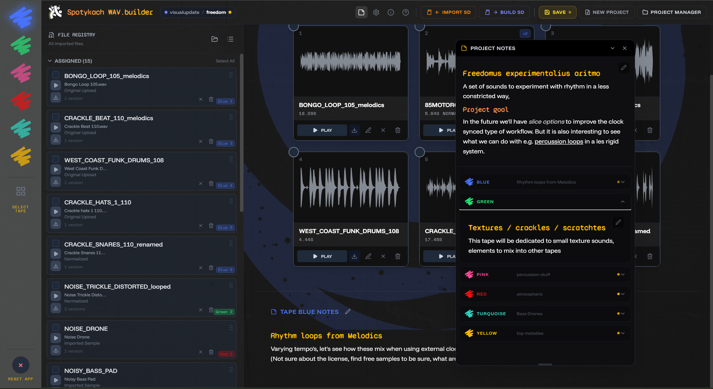
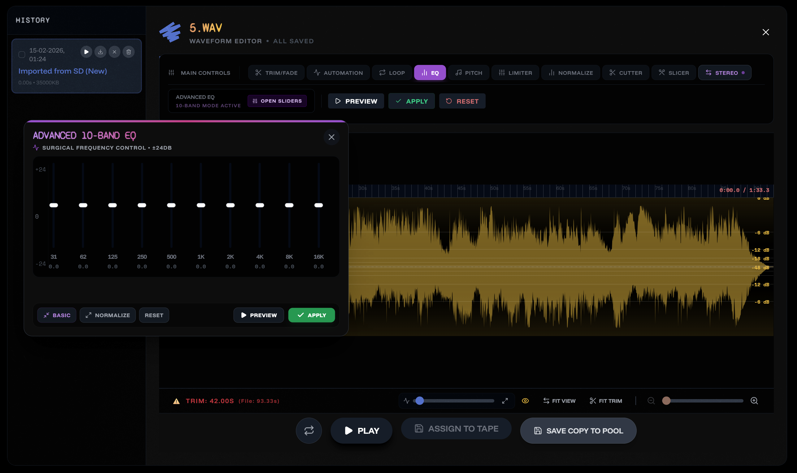
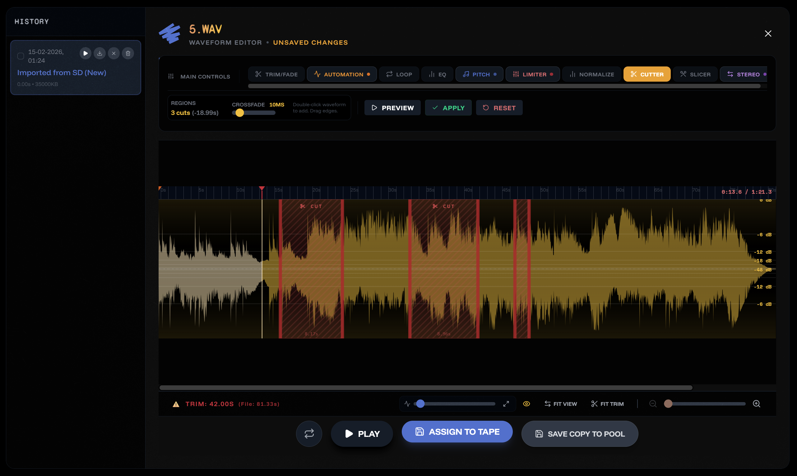

# Spotykach WAV Builder

[](https://jonwaterschoot.github.io/spotykach_WAV_builder/)

> **⚠️ Desktop Only:** This application is optimized for **Desktop Chrome/Edge** browsers. It is **not supported on mobile devices** due to the complex audio processing and file system interactions.

A specialized tool for preparing audio files for the **Synthux Spotykach Looper playground**. It streamlines the process of converting, trimming, and organizing samples and projects to meet the strict firmware requirements (48kHz Stereo WAV).



Core concept: allow to either import audio files recorded with Spotykach or make a collection of audio files and upload those to the SD card.

Spotykach has 6 tapes, each tape has 6 slots. Each slot can hold a mono or stereo sample. (only the first 42 seconds of each sample are used)

This app allows you to save these sets of tapes as a project, and load them later. You can also sync them with your Spotykach SD card.

The app has options to write notes that live inside the project. Make notes on your tapes or a general project note. These notes are saved in the project.json file.

A config.txt file is also created and saved in the project. This file contains the configuration for the Spotykach hardware. You can edit this file in the app, and sync it with your Spotykach SD card. For now it is limited to just a few midi settings - testing the waters.

## Features

-   **SD Card build**: Build SK/ folders directly to the SD card containing config.txt and WAV files.
-   **SD Card project backup**: Sync projects directly with the Spotykach hardware SD card using the File System Access API (Chrome/Edge).
-   **Audio Processing**: Drag and drop any audio format with automatic conversion to the required 48kHz 16-bit Stereo WAV format.
-   **Tape-Based Organization**: Manage samples across 6 color-coded "Tapes" with 6 slots each that mirror the physical hardware interface.




-   **Waveform Editor**: 
    -   The editor uses a destructive workflow, yet a history of each iteration is kept in the project and shown per file in the editor's history panel. This allows you to go back to any previous iteration of the file.

    -   **Main Controls**: Global playback, waveform display, and file management.
    -   **Trim / Fade**: Set start/end trim points and apply fade-in/fade-out curves. **Hardware Constraints**: Visual indicators for the strictly enforced 42-second hardware buffer limit.
    -   **Automation**: Draw volume automation envelopes over time (ramps, dips, custom shapes).
    -   **Loop**: Define loop regions with configurable crossfading for seamless, gapless loops.
    -   **EQ**: 3-band, or 10-band equalizer for tonal shaping of the audio.
    -   **Pitch**: Pitch-shift the sample or multiple parts of the sample.
    -   **Limiter**: Ceiling limiter to prevent clipping and control peak output level.
    -   **Normalize**: Boost or lower the file's peak or RMS level to a target value.
    -   **Cutter**: Cut out unwanted sections and merge remaining pieces with a crossfade.
    -   **Slicer**: Divide audio into up to 32 slices with keyboard/MIDI auditioning. (not yet implemented on hardware)
    -   **Stereo**: split stereo files into two mono files with visual feedback of the two channels.
-   **Sample Browser**:
    -   **Curated Packs**: Browse and import community-contributed sample packs.
    -   **Library Management**: Build a persistent user library and pull samples from other local projects.
-   **Project Portability**: Save and restore work states via Project JSON or create full backups to local storage and SD cards.



## Technology Stack

This project is built using:

-   **[React](https://react.dev/)**: UI Framework.
-   **[Vite](https://vitejs.dev/)**: Build tool and dev server.
-   **[Tailwind CSS](https://tailwindcss.com/)**: Styling.
-   **[WaveSurfer.js](https://wavesurfer.xyz/)**: Audio visualization and manipulation.
-   **Google Deepmind Antigravity**: Experimental agentic AI used for development.

## Getting Started

1.  **Clone the repository**
    ```bash
    git clone https://github.com/jonwaterschoot/spotykach_WAV_builder.git
    cd spotykach_WAV_builder
    ```

2.  **Install Dependencies**
    ```bash
    npm install
    ```

3.  **Run Development Server**
    ```bash
    npm run dev
    ```

4.  **Build**
    ```bash
    npm run build
    ```

## Live Demo

Check out the live version here: [https://jonwaterschoot.github.io/spotykach_WAV_builder/](https://jonwaterschoot.github.io/spotykach_WAV_builder/)

## Publishing (maintainers)

The live site is published **manually, from a maintainer's machine**. There is no Actions
workflow, so **pushing to `main` does not update the site** — main can be ahead of what is live.

```bash
npm run deploy        # builds, then pushes dist/ to the gh-pages branch
```

Commit first: the deploy ships the working tree, not `main`. It takes about half a minute end to
end, so small changes — one new screenshot in a news article — are deployed the same way as a
release. On Windows, use `npm.cmd run deploy` if PowerShell blocks the script.

Full detail in [docs/deployment_guidelines.md](docs/deployment_guidelines.md).


## Roadmap

### Priority Features

- **Onboarding**: Improved first-run flow explaining projects and tapes before entering the app.
- **Editor UX**: Clearer destructive-workflow messaging, "Done" close button, improved history panel.
- **Project Cleanup**: Remove unused/history files from a project; keep only originals and active samples.
- **History & Trashcan** *(under consideration)*: Temporary trashcan for deleted files; Undo/Redo for editor actions.
- **Right-Click Context Menu**: Quick actions (Edit, Move, Delete, Show in browser) on sample cards.
- **SD Card: Prepare empty project**: Erase/format SD card with warnings and content comparison.
- **config.txt download**: Download and send config.txt directly to SD card without a full sync.
- **Sync User Library**: Sync personal sample library to SD card *(almost done — needs final testing)*.
- **Offline Sample Packs**: Download GitHub sample packs for offline use.

### Long Term

- **Desktop App**: Electron/PWA wrapper for native dialogs and offline use.
- **Cloud Sync**: Google Drive/Dropbox integration?
- **Simplified export-only tool**: Stripped-down version — open a file, convert, download. No project management.
- **Mobile Optimization**: Improved layout for tablets/phones *(not a priority)*.

## Documentation & Guides

Whether you are a musician contributing a sample pack, a user sharing a project layout, or a developer/maintainer working on the app, check out the relevant guides below:

*   **For Musicians & Preset Creators**:
    *   [Sample & Preset Submission Guide](docs/presets-samples/README.md) – How to package, name, and license samples and presets before submitting them.
*   **For Developers & Maintainers**:
    *   [Preset Upload & Integration Guide](public/presets/README.md) – Developer instructions on integrating presets, JSON schema specs, and deploying sample packs.
    *   [Audio Processing & Normalization Scripts](scripts/normalize-audio.md) – Documentation for running scripts to normalize, FLAC-compress, and tag audio files.
    *   [Documentation Index](docs/README.md) – Every documentation file in the repository, what it covers, and whether it is still current.

## Contributing

We welcome contributions!
-   **Found a bug?** Open an issue on [GitHub](https://github.com/jonwaterschoot/spotykach_WAV_builder/issues).
-   **Have an idea?** Discuss it with us on the **Synthux Academy Discord**.
-   **Want to build locally?** Check out our [Contribution Guide](CONTRIBUTING.md).

## License

**DO WHAT THE FUCK YOU WANT TO PUBLIC LICENSE**
Version 2, December 2004

Copyright (C) 2026 @jonwaterschoot

Everyone is permitted to copy and distribute verbatim or modified copies of this license document, and changing it is allowed as long as the name is changed.

DO WHAT THE FUCK YOU WANT TO PUBLIC LICENSE
TERMS AND CONDITIONS FOR COPYING, DISTRIBUTION AND MODIFICATION

0. You just DO WHAT THE FUCK YOU WANT TO.
