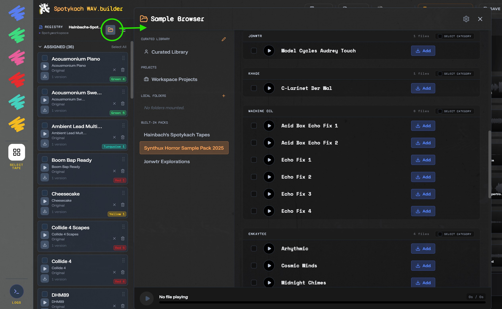
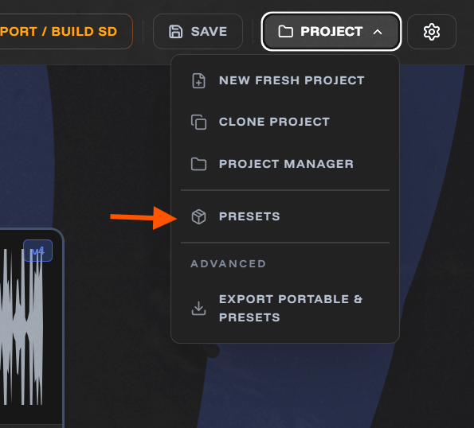

# Spotykach Preset & Sample Pack Submission Guide

A comprehensive guide for **External Artists**, **Spotykach Users**, and **App Maintainers** on how to prepare, package, and submit sample packs and project presets to the **Synthux Spotykach WAV Builder**.

> [!NOTE]
> This is a guide for **guest artists** contributing sample packs and **users** wishing to share presets.
> If you are an **app developer or maintainer** looking to write manifest JSON descriptors, deploy assets to Cloudflare R2, or run Python audio normalization scripts, please refer to the technical developer guides:
> * [Preset Upload & Integration Guide](../../public/presets/README.md)
> * [Audio Normalization & Compression Scripts](../../scripts/normalize-audio.md)

---

## Quick Navigation
* [💡 Concepts: Sample Packs vs. Project Presets](#-concepts-sample-packs-vs-project-presets)
* [🎨 For External Artists (Contributing a Sample Pack)](#1-for-external-artists-contributing-a-sample-pack)
* [🎛️ For Spotykach Users (Contributing a Preset/Layout)](#2-for-spotykach-users-contributing-a-presetlayout)
* [📋 Submission Checklist & Template](#3-submission-checklist--template)
* [📮 Where to Send It](#-4-where-to-send-it)

---

## 💡 Concepts: Sample Packs vs. Project Presets

Before preparing your contribution, it's important to understand how Spotykach distinguishes between a **Sample Pack** and a **Project Preset**:

| Feature | 📦 Sample Packs | 🎛️ Project Presets (Layouts) |
| :--- | :--- | :--- |
| **What it is** | A library of curated audio files available in the **Sample Browser**. | A saved project configuration where all slots have been mapped to specific samples. |
| **Slot Limit** | **Unlimited**. A sample pack can contain 50, 100, or more files; users can select any of them to load. | **Maximum of 36 slots** (6 tapes × 6 slots) corresponding to the hardware looper. |
| **How it loads** | Users browse individual samples and manually assign them to any tape slot. | Loads samples into pre-assigned slots automatically, along with custom tape notes. |
| **Sharing Method** | Handled by maintainers updating the catalog in the web app database. | Can be exported/imported as a `.json` settings-only file or shared as a `.zip` archive. |

### 🎥 Video Demonstration
Watch the video below for a visual walk-through of the Spotykach WAV Builder concepts and workflows:
* [Spotykach WAV Builder Video Demo](https://www.youtube.com/watch?v=X2KiL52vBNM)

---

### 🎨 Visual Showcase: Sample Browser vs. Presets Menu

#### 1. Sample Pack Browser
The **Sample Browser** allows users to browse cataloged packs (like Hainbach, Jonwtr, or Horror) or their own curated library, preview audio, and add files to their project's pool. A pack is **not** limited to 36 files; artists can provide a large library from which users can choose.

Users open the sample pack browser either via the add + icon in an empty slot or via the sidebar folder icon.

* **Sidebar Layout:**
  
* **Interactive Demo:**
  <video src="img/samplepackbrowser.mp4" controls width="100%"></video>

#### 2. Preset Manager
The **Presets Menu** loads starter configurations or community loopers. Loading a preset fills all 36 slots instantly and applies any custom tape names or notes. You can also export/import these to share project presets with the community.
* **Presets Menu Interface:**
  
* **Interactive Demo:**
  <video src="img/presetsbrowser_1.mp4" controls width="100%"></video>

---


## 🎨 1. For External Artists (Contributing a Sample Pack)
This section is for guest artists contributing their first sample pack to Spotykach. **You do not need to own a Spotykach device or know how to use the web app!**

### ⚠️ Hardware Limitations & Audio Specifications
Your samples will be loaded onto physical hardware (a custom Daisy Seed-based looper). Because of this, please design your pack with the following constraints:
* **Duration Limit**: Strictly **42 seconds per sample**. Any audio past 42 seconds is ignored or cropped by the hardware.
  - In the editor the full sample is shown and users could still pick a different portion of the sample to use, so technically you can submit longer files, but the hardware will only use the first 42 seconds.
* **Tapes & Slots**: Spotykach organizes files into 6 color decks (Blue, Green, Pink, Red, Turquoise, Yellow), with 6 slots each, making a total of **36 sample slots**.
  * **Sample Packs**: There is **no limit** to the number of files in a submitted sample pack (it can have 50, 100, or more samples). Users can pick and choose any samples from the pack to load into their custom slots.
  * **Presets**: Only a project preset is strictly limited to exactly **36 mapped sample slots** (6 tapes × 6 slots).
* **Audio Format**: You can submit your files as high-quality `.wav` or `.flac` (we recommend 24-bit WAV). The app maintainer will automatically process, normalize, and convert them to the formats needed for the app and the hardware.

### 📁 Organizing Your Files
1. **Filename to Display Title**: Keep your file names clean. The builder app automatically generates sample titles by removing the extension and converting hyphens (`-`) or underscores (`_`) to spaces.
   * *Example:* `Roaring_Drone_C3.wav` $\rightarrow$ `Roaring Drone C3`
   * *Tip:* If you have specific titles that filenames cannot represent, include a text file list.
2. **Categories (Subfolders)**: If you want your samples categorized in the app (e.g., Drums, Drones, Melodies), group them into subfolders before submitting.
   * Subfolder names are extracted directly to create the **Category** tag in the app's Sample Browser.
   * If you don't use folders, all samples will be labeled under a default **"General"** category.

### 📄 Pack Metadata Required
When submitting, you must provide:
* **Artist Name / Moniker**
* **Short Description**: A brief, 1-2 sentence description shown in the app's catalog card.
* **Full Bio / Pack Description**: A longer description or message to users (shown in the pack info modal).
* **Links**: Social, website, Patreon, or Bandcamp links to link from your artist profile.
* **License**: A clear license for the samples (e.g., CC-BY 4.0, CC0, or a custom statement such as *"Free for non-commercial music, no resale as samples"*).
* **Cover Image**: A landscape cover image (JPEG or PNG, landscape aspect ratio like 3:2, 4:3, or 16:9, e.g. min 1200x800px; landscape is preferred as it is displayed in the hero banner).

---

## 🎛️ 2. For Spotykach Users (Contributing a Preset/Layout)
If you own the device and have designed a custom project layout (settings, slot mappings, tape configurations) that you want to share with the community:

### 📥 Exporting Your Preset File
1. Open the [Spotykach WAV Builder App](https://jonwaterschoot.github.io/spotykach_WAV_builder/).
2. Load your project.
3. Click the **Export** button in the top-right header.
4. Select the **Project Preset** tab.
5. Choose **"Settings-Only Preset (JSON)"**. This exports a `.json` file containing all of your slots, tape names, notes, and midi configurations.
6. Click **Export Preset** to download.

### 📋 What to Submit
* The exported `.json` file.
* **Preset Metadata**: Name of your preset, a short description, and an optional cover image.
* **Required Packs**: A list of the community sample packs your preset relies on.
* **Custom Samples**: If your preset uses custom samples that aren't in the default library, you must also submit those samples following the **External Artists** guide above.
* **(Optional) Hardware-Ready SD ZIP**: If you want to offer a fully built SD-card backup download for users:
  1. Open the **Export** menu, go to **Portable SK Folder**.
  2. Click **Download Portable SK Folder (ZIP)**.
  3. Submit this ZIP along with the preset JSON.

---

## 📋 3. Submission Checklist & Template

Copy and paste the template below to structure your submission:

```markdown
# Submission Template

## 👤 Artist & Pack Info
* **Artist Name:** [Your Name / Moniker]
* **Sample Pack Name:** [e.g., Dust & Tape Loops]
* **Short Description (1-2 sentences):** [Shown on the app library card]
* **Full Bio / Pack Description:** 
  [Write a detailed description here. Tell us about the gear you used, the vibe, or how to use these sounds!]

## 🔗 Links (Socials & Bio)
* [Website](http://...)
* [Instagram](https://instagram.com/...)
* [YouTube](https://youtube.com/...)
* [Bandcamp](https://...)
* [Patreon](https://patreon.com/...)

## 📄 Licensing & Permissions
* **License Type:** [e.g., CC-BY 4.0 / CC0 / Custom Restriction]
* **License Text:** [e.g., Free to use in your music. No resale of the sample pack.]

## 📁 Sample Organization
* **Sorted into Categories?** [Yes / No]
* **Category Titles (if sorted):** [e.g., Bass, Perc, Synths, FX]
* **Sample Titles:** [Extracted from filename / Provided in custom list below]
  *(If using custom titles instead of filenames, list them here:)*
  - filename.wav -> "Custom Title 1"
  - filename2.wav -> "Custom Title 2"

## 🖼️ Cover Art
* [ ] Included landscape cover image (PNG or JPEG, landscape aspect ratio like 3:2, 4:3, or 16:9, e.g. min 1200x800px)

## 🎛️ Preset Details (Optional - for Spotykach Owners)
* [ ] Exported settings-only `.json` preset file attached.
* [ ] (Optional) Exported Portable SK Folder `.zip` attached.
```

---

## 📮 4. Where to Send It

There is no upload in the app and no submission form — a submission is a message with files attached.

| Route | |
| :--- | :--- |
| **Discord** | `jonwtr` — the easiest route, and the best one for questions before you start. |
| **Email** | `jon [at] synthux.academy` |

**Send the small things directly**: the preset `.json`, the cover image, the filled-in template above.

**Send audio as a link** — WeTransfer, Google Drive, Dropbox, whatever you already use. A sample pack
is far too large to attach, and nothing is uploaded through the web app.

Once it arrives, the maintainer normalizes the audio, deploys it, and adds the entry to the app's
catalogue. Expect a reply rather than silence; if a submission is missing something, that is what the
conversation is for.

