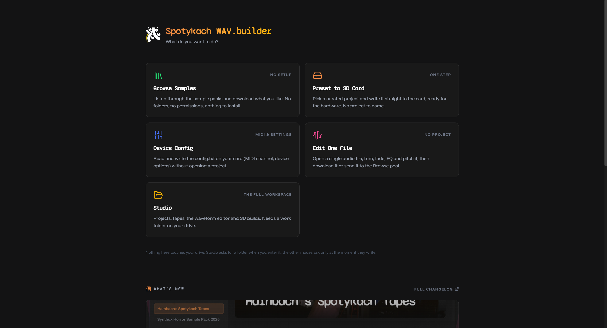
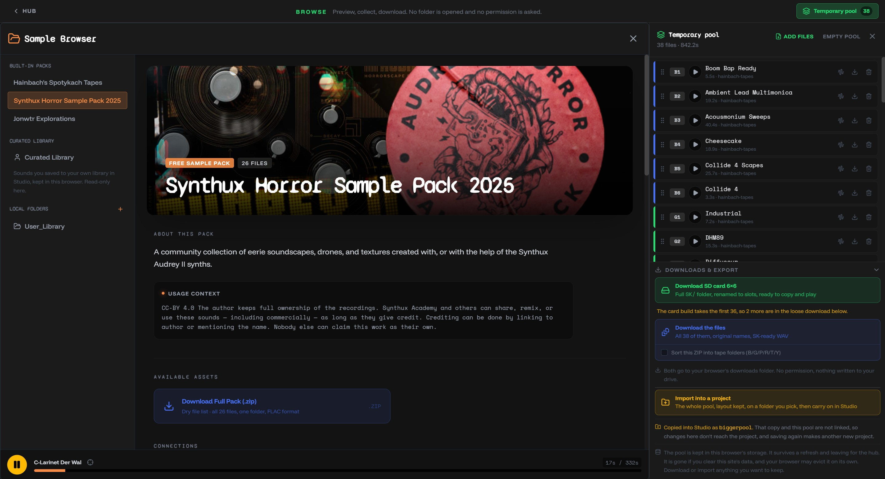
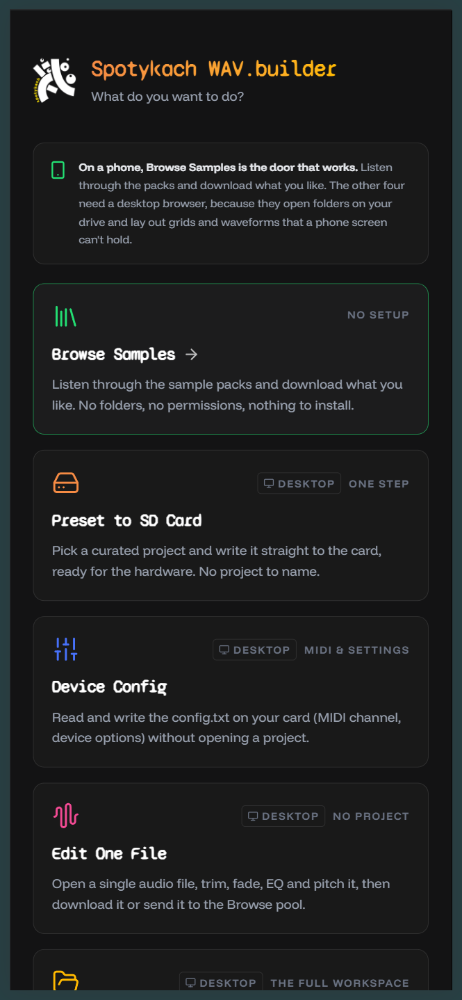

# v4 "Pervak" - five doors

The app used to be one door. A setup wizard demanded a work folder, an SD card and a project name before you could see anything at all, whether you had come to build a full six-tape project or just to listen to a few samples.

It is now five doors, and four of them need no setup whatsoever.

*Named for первак, the first run off a still, the strong opening fraction. Fitting for a release whose premise is separating one muddled thing into clean tiers.*

## The five doors

- **Browse Samples** - a simple sample browser. Preview, collect what you like, and download it as SK-ready files, build it straight to an SD card, or send the whole selection into a full project.
- **Presets** - fully prepared SK folders, files already in the right format and folder structure. Pick one, pick your card, done.
- **Device Config** - read and write `config.txt` files.
- **Edit One File** - edit and download a single audio file, (re)formatted to the correct settings.
- **Studio** - the full project manager, linked to a local workspace.

Each door is a real link you can bookmark or share (`#/browse`, `#/presets`, `#/config`, `#/editor`, `#/studio`), each loads only what it needs, and nothing asks for a folder until the moment something is actually written.

## Start with nothing

No wizard, no folder, no project. Browse the packs, preview them, collect a selection in the temporary pool, and take it away: as a card-ready 6×6, or as all the files under their original names. There is no permission prompt anywhere in that path.

Your own files go in too, dropped straight onto the column or added from the pool header, and they are converted to SK-ready WAV as they land. When you do want a project, one button hands the whole pool over to Studio.

## On a phone

Browse is the door that works on a phone: the sources list becomes a drawer, the pool becomes a full-screen sheet, and the hub says so up front rather than letting you walk into a screen that needs a desktop.

## What else changed

- **The SD card is a build target, not a backup.** A build used to write three copies of the same audio. With the defaults it now writes `SK/` and nothing else, and the other two are opt-ins, off by default.
- **Before a build, you are told what leaves the card.** Every file about to be deleted *or* overwritten is named, and one button imports them into the pool first, so "clean" is no longer the only way out.
- **Writes can't destroy what they were replacing.** Every write goes to a temp name and is swapped in only after it closes cleanly.
- **There is one backup, and it is deliberate.** Workspace backup goes to a folder you pick each time, and shows exactly what it contains and what it weighs before it opens the picker.
- **Auto-save actually exists.** A closed tab or a crash no longer costs you the open project.
- **Settings is where options live**, in three tabs, instead of controls scattered across the Project Manager, the build dialog and the editor sidebar.
- **The Project Manager is a list of projects again**, not a two-column mirror with a sync column down the middle.
- **A project opens on all six tapes**, so you land on the overview rather than wherever you happened to be standing last time.

There is a great deal more. The full list is in the [changelog](https://github.com/jonwaterschoot/spotykach_WAV_builder/blob/main/CHANGELOG.md).

## Next

A proper guided tour, as a tutorial video, is the plan. Until then: open the hub and pick a door.
