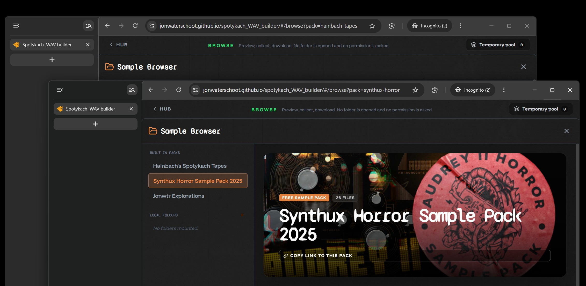

# Every sample pack has its own link

Open a pack in **Browse Samples** and the address bar now says which one it is: `#/browse?pack=synthux-horror`, `#/browse?pack=hainbach-tapes`. Copy it, bookmark it, send it to someone, and it opens on that pack rather than on the browser's first one.

The **Copy link to this pack** button on each pack still does the same thing, for when the address bar is out of reach.

[Full changelog](https://github.com/jonwaterschoot/spotykach_WAV_builder/blob/main/CHANGELOG.md)
