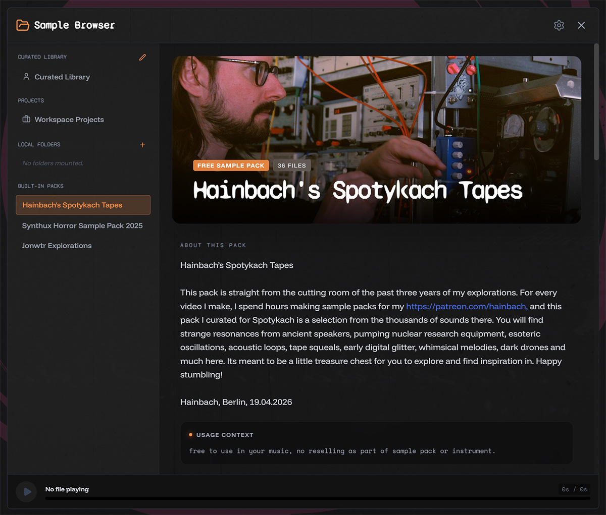
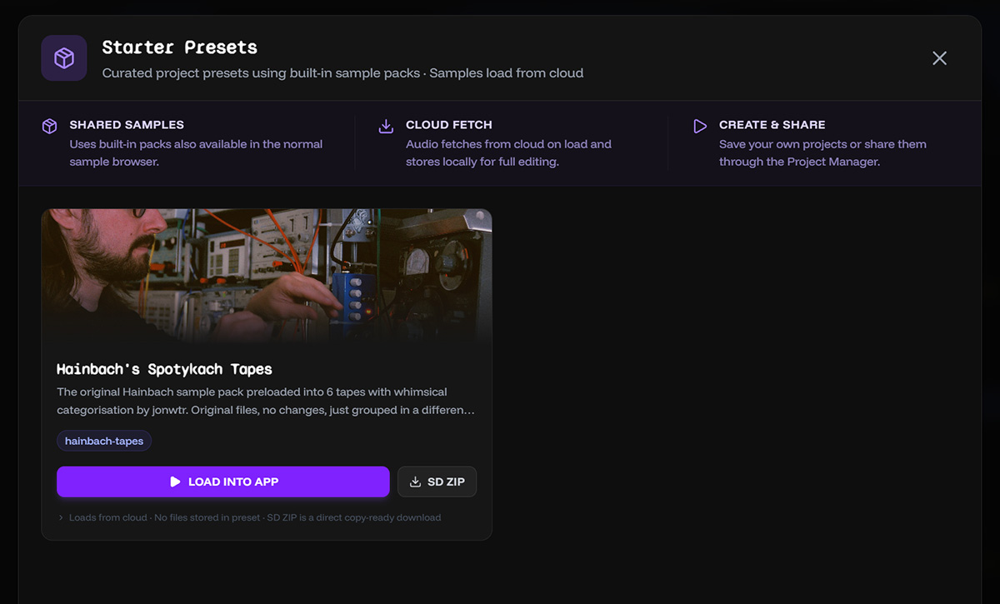

# Hainbach's "Spotykach Tapes" are here

You can now use Hainbach's official sample pack directly in the app. Use them in the Sample browser or download the whole pack as a ZIP.

I've also prepared a preset project file that loads all 36 samples into a new project for you.

This new project preset function allows you to preload a project with samples, which is great for getting started quickly. It also allows you to save a project with all samples loaded, which is great for sharing your work with others.

### Sample Pack Browser

Hainbach made a video testing out Spotykach and created this pack specifically for Synthux. Its a curated collection of his vast resource of samples he offers on his Patreon. Check out his [Patreon](https://www.patreon.com/hainbach) to support his work and get more samples like these!

Use the sample browser to download samples into your local project workspace, use the + in tapes view, or enter the folder icon in the left panel.
Hainbach recently made a video where he tried out Spotykach and he also created a Sample pack for Spotykach. You can watch [the video on YouTube](https://www.youtube.com/watch?v=H9CUtnEeF0s)

There are now three main packs:
- Hainbach's Spotykach Tapes
- Synthux Horror Sample Pack 2025
- Jonwtr Explorations

<video controls src="images/Hainbach-samplepack.mp4" title="Title"></video>

### Project Presets

If you want to start making noise fast, use a preset. It creates a new project with all samples already loaded. You can still swap them out later.

To save a project preset, go to the project manager, and click on the download icon of a project in the project list. Use the option "Settings-Only ZIP" to ensure you pack only files not in the Sample Packs.

Load the Hainbach project to fill up all 36 slots, I organized them in a few categories, using the notes to give the tapes a title. you can later tweek them to your liking, as you can with any project.

I intend to make another preset project that uses samples from all available packs. Tha only uses half the slots, if you have a few favorites let me know.

<video controls src="images/WAV-builder-Project-presets.mp4" title="Title"></video>

If you want to contribute some presets or samples, message me on Discord (@jonwtr).